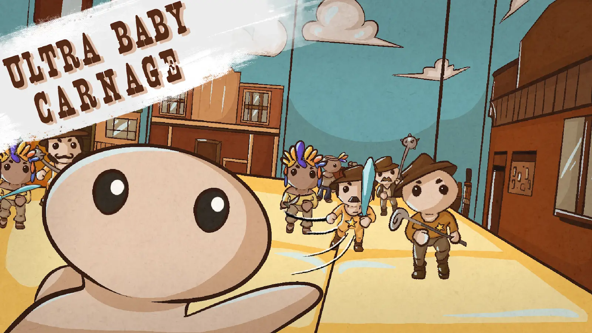
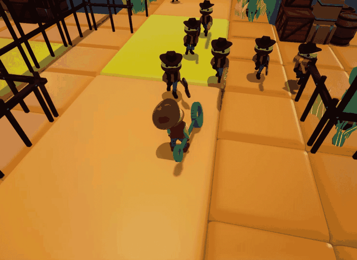

<h1 align="center">Ultra Baby Carnage</h1>

  

  <strong>A third-person wave-based arena brawler built in Unreal Engine 4.</strong> 
  Dual-hand combat, modular items, enemy AI, and data-driven progression inside a chaotic indoor playground.

  
  
  
  
  

  <a href="https://drive.google.com/file/d/1qz_VkykGQK51RnuRpyYMp8G0uf4JzD7Y/view"><strong>Editor Gameplay (temporary)</strong></a>
  ·
  <a href="https://drive.google.com/drive/folders/1YadlTnKj6fz8xOdq-mVtqjROHWfdYZZ_"><strong>Gameplay Clips</strong></a>
  ·
  <strong>Windows Build — coming soon</strong>

  

Chaining attacks with the Bubble Wand while its crowd-control effect traps enemies in bubbles.

## Project Snapshot

| | |
|---|---|
| **Role** | Gameplay Programmer |
| **Engine** | Unreal Engine 4.25 |
| **Languages** | C++, Blueprint |
| **Team** | Evil Artichokes — approximately 9 people, including 2 programmers |
| **Development** | 2020–2021 academic production cycle |
| **Platform** | Windows PC |
| **Status** | Completed team project; archived portfolio copy |

## Overview

*Ultra Baby Carnage* is an academic team project in which the player fights through escalating enemy waves inside a colourful, multi-level playground. Its combat loop revolves around independently equipped hands, improvised weapons, chained attacks, temporary and permanent effects, and environmental interactions.

The project uses a hybrid C++ and Blueprint architecture. Reusable native systems expose gameplay events and data to Blueprint, while Data Assets, Data Tables, curves, Behaviour Trees, animation assets, and UMG widgets support content iteration.

## My Contributions

I worked as one of two programmers in a multidisciplinary team. My documented contributions include:

- Co-developed the multi-step combo system and integrated its combat animations.
- Refactored the combo-animation workflow as the combat system evolved.
- Implemented and extended character effects used by weapons, consumables, hazards, and equipment.
- Implemented the complete enemy behaviour layer, including movement, player search and pursuit, targeting, attacks, damage reactions, stun handling, and Behaviour Tree integration.
- Built the kill-reward and end-of-wave economy loop: defeated enemies award credits that the player can spend in the shop between waves.
- Authored the shop's item database and implemented its user interface.
- Authored the tiered enemy-weapon database used by the wave system to equip enemies with progressively stronger weapons.
- Implemented and iterated on consumables, trinkets, resistance/movement/damage effects, and their reusable effect interfaces.
- Implemented and reworked turret and interactable-turret gameplay, projectile parameters, and mine/mine-gun behaviour.
- Contributed to the wider item, animation, interactable, hazard, spawning, and score pipelines.
- Connected gameplay code, Blueprint content, UI feedback, and data-driven assets.

The repository preserves the original team development history and identifies later portfolio-migration changes separately. I present the project as collaborative work and do not claim sole authorship.

## Technical Highlights

### Dual-hand combat and combo flow

The player can equip items independently in each hand and chain attacks into multi-step combinations. Combo nodes retain the weapon and hand used for each input, while item data selects the relevant attack animation and effect for the current combo level. The project also includes data-defined item-combination recipes and weapon synergies.

### Modular items and status effects

Weapons, consumables, trinkets, bullets, and pickups share reusable gameplay foundations. Their definitions contain power, durability, use time, knockback, rarity, icons, attack data, animations, and applied effects. Timed and permanent effects—including burning, slowing, bleeding, poison, stun, root, freeze, bounce, resistance, and stat boosts—can originate from attacks, items, equipment, or environmental hazards.

### Enemy AI

I implemented the enemy gameplay loop end to end: movement, player discovery and pursuit, target handling, attacking, damage reactions, stun behaviour, and the transitions connecting those states. Enemies use a Behaviour Tree and Blackboard supported by custom tasks, services, and an environment query. The controller uses Unreal's Detour Crowd AI Controller to improve navigation within enemy groups.

### End-of-wave economy and enemy equipment scaling

Enemy defeats award credits that become spendable when the wave ends. I implemented the shop UI and authored its item database, organized into round-specific pools for weapons, consumables, and buffs. I also authored the tiered weapon database consumed by the wave system so later enemies can receive increasingly powerful equipment.

The wider native wave system coordinates round transitions, enemy counts, spawn batches, delays, maximum active enemies, and completion. Primary Data Assets, evaluator classes, curves, and tiered Data Tables configure progression without hard-coding every round.

### Modular interactions and hazards

Reusable interaction detection supports doors, distributors, repair stations, turrets, damaging pools, slowing barrels, bounce pads, dash pads, and projectile hazards; several interactions spend points earned during combat.

## Project Features

- Independently equipped hands and multi-step weapon combos.
- Melee, ranged, throwable, consumable, and passive-effect items.
- Timed and permanent gameplay effects.
- Behaviour Tree enemies with crowd-aware navigation.
- Configurable rounds, spawn pacing, enemy tiers, and item budgets.
- Kill rewards and an end-of-wave shop economy.
- Progression-based shop inventory, rarity pools, and enemy weapon tiers.
- Point-gated doors, distributors, hazards, and environmental interactions.
- Health, inventory, equipment, shop, damage, game-over, settings, tooltip, and pause UI.
- Animation-driven combat using Montages and dedicated Animation Notifies.

## Technology

- Unreal Engine 4.25
- C++ and Unreal Engine Blueprints
- UMG
- Behaviour Trees, Blackboards, environment queries, and Detour Crowd navigation
- Primary Data Assets, Data Tables, and Curve assets
- Animation Montages and Animation Notifies
- Unreal delegates, timers, Blueprint-native events, and actor components

## Media

- [Unreal Editor gameplay walkthrough](https://drive.google.com/file/d/1qz_VkykGQK51RnuRpyYMp8G0uf4JzD7Y/view)
- [Gameplay clips and GIFs](https://drive.google.com/drive/folders/1YadlTnKj6fz8xOdq-mVtqjROHWfdYZZ_)

The final repository will feature up to three focused previews: a crowd-combat encounter, a weapon/effect example, and an environmental interaction.

## Build and Running the Project

A portfolio build is being prepared and will be linked here after validation. The archived source project targets Unreal Engine 4.25 on Windows.

## Project Context

- **Context:** Academic multidisciplinary team production
- **Team:** Evil Artichokes, approximately nine people across programming, game design, 2D art, and 3D art
- **Programming team:** Two programmers
- **Repository history:** Original team development history preserved; later portfolio migration changes identified separately

## Credits, Ownership and Status

*Ultra Baby Carnage* was created collaboratively by Evil Artichokes. Third-party tools and assets remain the property of their respective authors.

> This repository is shared for portfolio review. It documents my contribution to a collaborative project and does not grant permission to reuse third-party or team-owned assets. Unless stated otherwise, it is not an open-source release.

**Project status:** Completed academic team project; no longer actively maintained.
